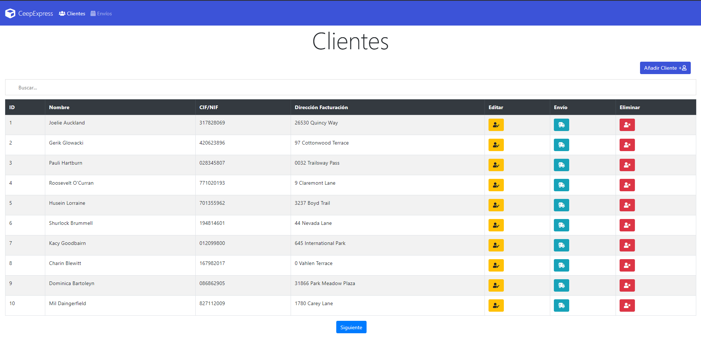
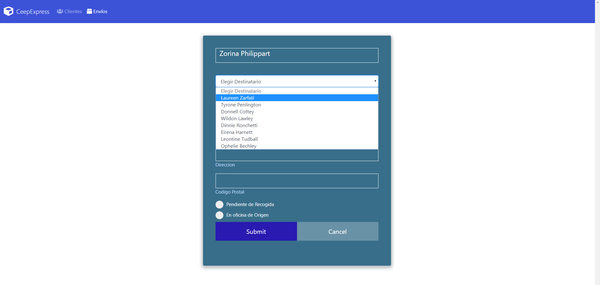

# CEEPEXPRESS finalPspInterfaces
 ## Proyecto Final de  Desarrollo de Interfaces y Programación de Servicios y Procesos 

 ### PROYECTO PROPUESTO:
 >  La empresa de mensajería CeepExpress desea mejorar sus
 > sistemas de información para ello ha encargado una consultoría con
 > el fin de conseguir este objetivo.

> En dicho trabajo se define un nuevo sistema de información en el
> que que ha definido una serie de componentes y sistemas a
> desarrollar.

> Se han definido dos partes, las dos usando tecnología web, una de
> ella dirigida a los empleados de las sucursales y oficinas que se
> encargará de la gestión de los clientes  y sus envíos.

 ### Gestión de Clientes:

 ### Gestión Envíos:
 

* Tecnologías utilizadas:
    * Fontend:
        * HTML CSS JavaScript JQuery
    * BackEnd:
        * Java JAX-RS Resful API (**Implementación REST**)
